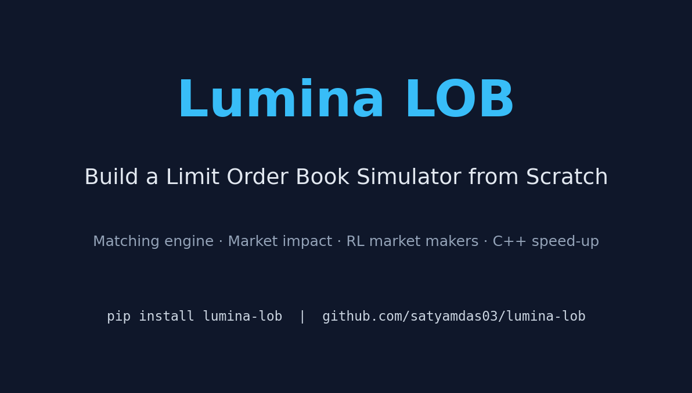

# Social Launch Drafts

These drafts are ready for review. Do **not** post them automatically — they require human approval and (for X) a logged-in browser session.

---

## LinkedIn post

I spent the last few weeks building **Lumina LOB** — a production-grade, open-source limit order book simulator aimed at quant-interview prep, market-microstructure research, and RL-based market making.

Why another LOB simulator? Most open-source ones are either too academic or too toy-like. Lumina tries to hit the middle ground:

✅ Price-time priority matching engine (Python + optional C++17 hot path)  
✅ Noise traders, informed traders, and inventory-aware market makers  
✅ Propagator / Almgren-Chriss market impact  
✅ Calibration to real tick data (Polygon.io + Databento)  
✅ Gymnasium RL environment + PPO/SAC training helpers  
✅ Matplotlib depth ladder, time-series plots, real-time animator, GIF/MP4 export  
✅ pip-installable: `pip install lumina-lob`  

It is fully tested (300 tests, 100% package coverage), has a MkDocs site, a CI matrix across Ubuntu/Windows/macOS × Python 3.11–3.13, and a technical blog post draft ready to publish.

If you are interviewing at Jane Street, Citadel, Optiver, or IMC — or just want to understand how markets work at the tick level — this is for you.

📦 Repo: https://github.com/satyamdas03/lumina-lob  
📚 Docs: https://satyamdas03.github.io/lumina-lob  
📝 Blog draft: https://github.com/satyamdas03/lumina-lob/blob/main/blog/build-a-lob-simulator.md

Would love feedback, issues, or contributions. Star the repo if you find it useful!

#quantitatvefinance #marketmicrostructure #algorithmictrading #reinforcementlearning #opensource #python #interviewprep

---

## X / Twitter thread

**Tweet 1 / 4**

Most LOB simulators are too academic or too toy-like.

I built Lumina LOB — a production-grade, open-source limit order book simulator you can pip install and actually use.

`pip install lumina-lob`

Repo + docs + blog draft below 🧵

https://github.com/satyamdas03/lumina-lob

---

**Tweet 2 / 4**

It includes:

• Price-time priority matching engine
• IOC / FOK / cancel / modify orders
• Noise, informed, and market-making agents
• Market impact models
• Calibration to Polygon/Databento tick data
• Gymnasium RL env for market making
• C++17 pybind11 hot path
• Matplotlib visualizations + GIF/MP4 export

---

**Tweet 3 / 4**

The matching engine in ~20 lines:

```python
from lumina_lob import Order, OrderBook, MatchingEngine, Side

book = OrderBook()
engine = MatchingEngine(book)

engine.process(Order(1, Side.BID, 100, 10))
engine.process(Order(2, Side.ASK, 100, 4))

print(book.trades)  # [(1, 2, 4)]
```

Full tutorial + RL examples in the docs.

---

**Tweet 4 / 4**

300 tests, 100% package coverage, CI on Ubuntu/Windows/macOS × Python 3.11–3.13.

Built as a live portfolio project for Jane Street / quant trading interview prep.

Docs: https://satyamdas03.github.io/lumina-lob  
Blog draft: https://github.com/satyamdas03/lumina-lob/blob/main/blog/build-a-lob-simulator.md

Feedback and PRs welcome.

---

## Social card

Use `blog/assets/social_card.png` as the featured image for the LinkedIn post or the first tweet.


