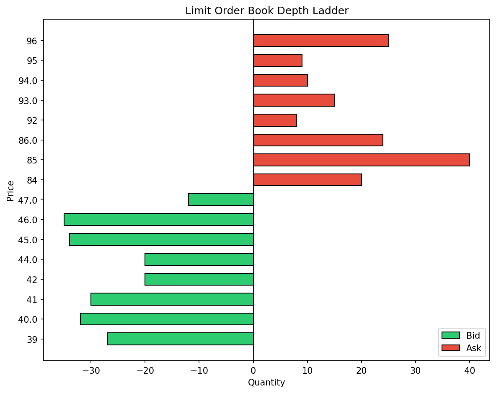
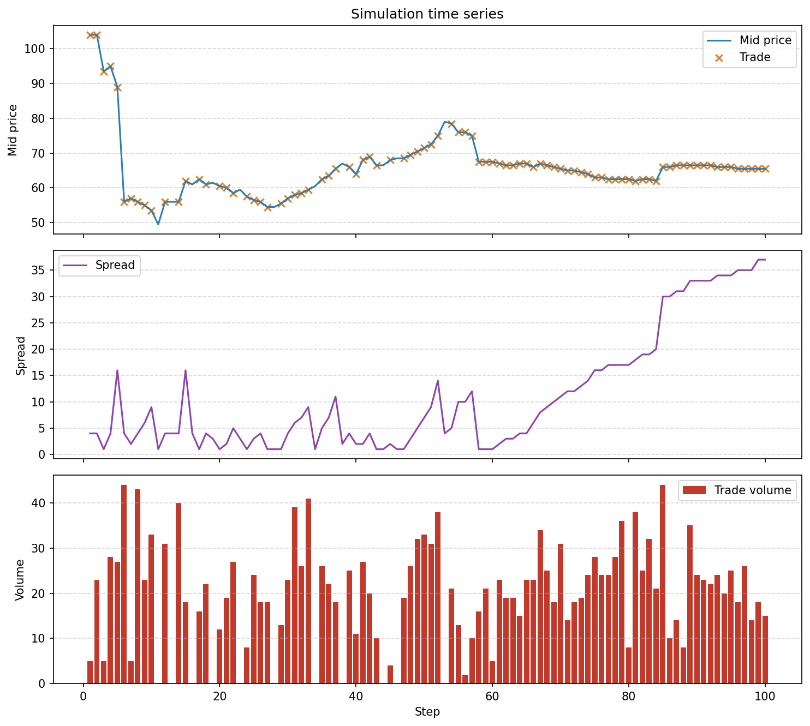

# Build a Limit Order Book Simulator from Scratch

_A production-grade, educational LOB simulator with matching engine, market impact, RL market makers, and real-data calibration._

**Repo:** [github.com/satyamdas03/lumina-lob](https://github.com/satyamdas03/lumina-lob)  
**Docs:** [satyamdas03.github.io/lumina-lob](https://satyamdas03.github.io/lumina-lob)  
**Install:** `pip install lumina-lob`

## Why build another LOB simulator?

Limit order books are the invisible plumbing of modern markets. Every time you buy a stock, option, or crypto token, your order is matched inside an LOB. Yet most educational simulators are either too abstract or too small to capture the dynamics that matter at the tick level:

- **Price-time priority** and queue position.
- **Adverse selection** when informed traders trade against you.
- **Inventory risk** for market makers.
- **Market impact** and how temporary vs. permanent effects differ.
- **Calibration** to real tick data so simulations behave like actual markets.

I built **Lumina LOB** to bridge that gap. It is open-source, pip-installable, fully tested, and documented. This post walks through the design decisions, the code, and the lessons learned along the way.

## What you will learn

- How a price-time priority matching engine works in Python.
- How to add realistic agents: noise traders, informed traders, and market makers.
- How to separate the *fundamental* price from the *observed* bid/ask.
- How to calibrate arrival rates, spreads, and impact from real Polygon/Databento data.
- How to train a reinforcement-learning market maker with Stable-Baselines3.
- Where the C++ speed-up layer fits and when it is worth it.
- How to visualize the book, history, and export replay GIFs/MP4s.

## Price-time priority: the core matching rule

At its heart an LOB is two sorted queues:

- **Bids** sorted descending by price.
- **Asks** sorted ascending by price.

Within the same price, orders are served by arrival time: first-in-first-out. This is **price-time priority**. When a new order arrives, the engine checks whether it crosses the best price on the opposite side. If it does, it trades; if not, it rests.

Here is the whole engine in about twenty lines:

```python
from lumina_lob import Order, OrderBook, MatchingEngine, Side

book = OrderBook()
engine = MatchingEngine(book)

# Resting bid for 10 shares at 100
engine.process(Order(1, Side.BID, 100, 10))

# Crossing ask for 4 shares at 100 — fills against the resting bid
engine.process(Order(2, Side.ASK, 100, 4))

print(book.trades)      # [(1, 2, 4)]
print(len(book))        # 6 shares still resting
```

The engine also supports IOC, FOK, cancel, and modify orders, which turns out to be essential for realistic agent behavior:

```python
from lumina_lob import OrderType

# Immediate-or-Cancel: execute what you can, cancel the rest
engine.process(Order(3, Side.ASK, 100, 100, order_type=OrderType.IOC))
```

## Building realistic agents

A simulator is only as good as its agents. Lumina includes four built-in agents:

1. **NoiseTrader** — random liquidity demand, calibrated from real trade-size distributions.
2. **InformedTrader** — trades directionally to simulate information arrival.
3. **MarketMaker** — symmetric quotes around a reference price with inventory limits.
4. **SkewedMarketMaker** — skews quotes based on inventory to manage risk.

Agents implement one simple method, `act(reference_price, book)`, and return a list of orders:

```python
from lumina_lob.agents import Agent, NoiseTrader, MarketMaker

sim = Simulation(
    agents=[
        NoiseTrader(arrival_rate=4.0, size_max=8, seed=1),
        MarketMaker(spread_half_width=2, quote_size=10, max_inventory=50),
    ],
    seed=42,
)
sim.run(n_steps=100)
print(sim.to_dataframe().head())
```

The `Simulation` orchestrator advances a reference price, asks every agent for orders, routes those orders through the matching engine, and records a step-by-step history DataFrame.

## Separating fundamental price from observed prices

One early mistake is to let the mid price drift randomly. In real markets, there is a *fundamental* fair value and the *observed* bid/ask are quotes around it. Lumina separates these:

- `ReferencePriceProcess` — a random-walk fundamental price.
- `OrderBook` — the actual resting orders.
- Impact models — push the fundamental price when large trades arrive.

This separation makes it possible to study **adverse selection**: if an informed trader buys aggressively, the fundamental price rises, and a market maker that filled the sell side loses on average.

## Market impact: propagator vs. Almgren-Chriss

Lumina implements two classic impact models:

- **PropagatorImpact** — temporary impact decays exponentially after each trade; permanent impact accumulates linearly.
- **AlmgrenChrissImpact** — splits each trade into permanent and temporary components with a decay parameter.

Both are fit from real trade data using the calibration helpers:

```python
from lumina_lob.data import PolygonClient, calibrate

downloader = PolygonClient(api_key="YOUR_KEY")
trades = downloader.get_trades("AAPL", "2026-06-01")
quotes = downloader.get_daily_bars("AAPL", "2026-06-01", "2026-06-01")
params = calibrate(trades, quotes)
print(params.arrival_rate, params.permanent_impact, params.temporary_impact)
```

## Calibration to real tick data

A simulator whose parameters are guessed is just a video game. Lumina can calibrate itself against real tick data:

- `calibrate_arrival_rate` from inter-arrival times.
- `calibrate_spread` from observed bid-ask spreads.
- `calibrate_trade_size` from empirical size histograms.
- `calibrate_impact` from signed volume and price changes.

Data comes from **Polygon.io** or **Databento** via built-in downloaders. Once calibrated, you can replay historical quote/trade events through the engine and validate that simulated spreads match the real distribution.

```python
from lumina_lob.data import ReplayEngine, validate_spread_distribution

replay = ReplayEngine(book, engine)
replay.run(df_events)
validate_spread_distribution(real_spreads, simulated_spreads)
```

## Training an RL market maker

Market making is a classic RL problem: quote bid/ask offsets and sizes, receive fills, earn the spread, and penalize inventory risk. Lumina exposes a `gymnasium` environment and trains with `stable-baselines3`:

```python
from lumina_lob.rl import MarketMakerEnv, train_ppo, save_model

env = MarketMakerEnv(seed=42)
model = train_ppo(env, total_timesteps=50_000)
save_model(model, "market_maker_ppo.zip")
```

The reward is the change in mark-to-market P&L minus a quadratic inventory penalty. The action space controls quote offsets around the reference price and the size to quote on each side. A trained PPO agent usually beats a naive symmetric market maker because it learns to skew quotes when inventory grows large.

## C++ acceleration layer

Python is fast to write but not fast enough to simulate millions of events per second. Lumina includes an optional **C++17** core bound via `pybind11`. The public API is identical:

```python
from lumina_lob import _core  # optional compiled extension

book = _core.OrderBook()
engine = _core.MatchingEngine(book)
```

On a 200k-order stream on a consumer laptop, the pure-Python engine processes roughly **12k events/sec** while the C++ engine reaches **54k events/sec** (about **4x faster**). Throughput varies with hardware, order mix, and whether the workload crosses the best bid/offer. The bigger win will come from a batch-submission API that keeps more work on the C++ side; that is on the roadmap.

## Visualization

Understanding an LOB from printed trades is hard. Lumina ships with Matplotlib visualizations:

**Depth ladder** — a snapshot of resting liquidity:



**Simulation history** — mid price, spread, and volume over time:



There is also a real-time animator and GIF/MP4 export for replay videos.

## Lessons learned

1. **Separate the fundamental price from the book early.** It makes adverse selection and impact modeling much cleaner.
2. **Agents must implement `on_fill`.** Without fill notifications, market makers cannot track inventory and will happily quote themselves into huge directional exposure.
3. **Calibration is not optional.** Guessed parameters produce toy markets. Real data grounds the simulator.
4. **Test the C++ path too.** The Python and C++ engines must produce identical trades, otherwise the speed-up layer is silently wrong.
5. **100% package coverage is worth it.** When every branch is exercised, refactors stop being scary.

## Try it yourself

```bash
pip install lumina-lob[viz]
```

```python
from lumina_lob import Simulation
from lumina_lob.agents import NoiseTrader, MarketMaker

sim = Simulation(
    agents=[
        NoiseTrader(arrival_rate=5.0, size_max=10, seed=1),
        MarketMaker(spread_half_width=2, quote_size=10),
    ],
    seed=42,
)
sim.run(n_steps=200)
print(sim.to_dataframe().head())
```

The full source, docs, and notebooks are at [github.com/satyamdas03/lumina-lob](https://github.com/satyamdas03/lumina-lob).

## What is next?

- Publish this post on Medium / Dev.to and cross-post on LinkedIn.
- Pin the repository on my GitHub profile.
- Add a batch-submission API to push the C++ engine past 100k events/sec.
- Calibrate against additional tick datasets and publish a reproducible benchmark report.

If you are interviewing at a quant firm, studying market microstructure, or building an RL trading system, I hope Lumina LOB saves you a few weeks of boilerplate. Contributions and feedback are welcome.

---

*Satyam Das · MIT License · [Lumina LOB on GitHub](https://github.com/satyamdas03/lumina-lob)*
